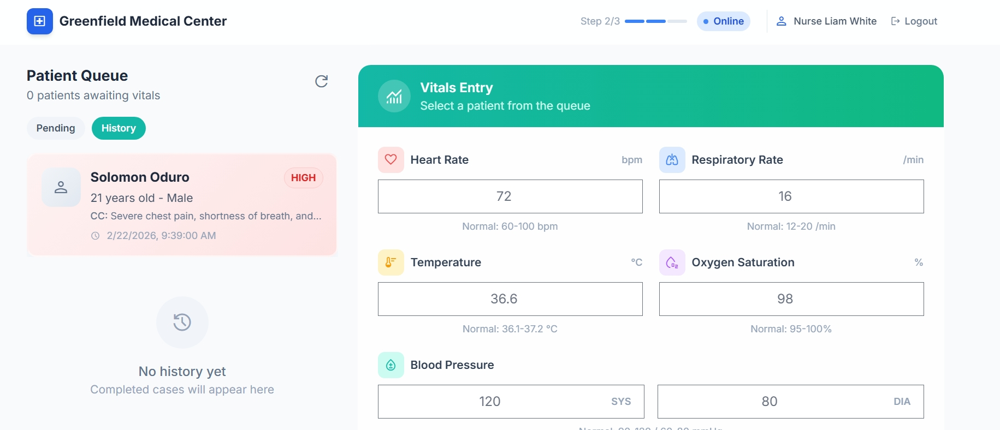

# Clinic Co-Pilot (AI in Healthcare)

Clinic Co-Pilot is a lightweight AI-powered clinical intake + decision-support assistant designed to reduce wait-time friction and prevent critical details from being overlooked during rushed patient encounters.

**At a glance:** a calmer, safer patient journey — from first symptom to final decision — built for busy clinics and real human stress. We make sure no one is missed, no signal is lost, and every provider has the clearest next step.


## Pitch

- Full pitch: `docs/pitch.md`
- Quick pitch: `pitch.md`
- Pages & routes: `page.md`

## Product Walkthrough (Screens)

**Page 1 — Landing Page**  
Welcomes patients to the hospital system, sets trust, and routes them to the right intake flow with clarity and empathy.


**Page 2 — Doctor Dashboard**  
Summarizes the case, highlights red flags, and supports structured clinical decisions with a clean, low-friction workflow.


**Page 3 — Healthcare Provider (Nurse) Portal**  
Captures vitals and completes intake handoff, ensuring structured data reaches the doctor without delays.



## What It Does

**Clinic Co-Pilot** supports 3 roles:

### 1) Patient Intake

- Patient enters demographics + chief complaint
- Structured symptom capture (duration, severity, associated symptoms, history)

### 2) Provider Vitals

- Health provider enters vitals (HR, RR, Temp, SpO2, BP, etc.)
- AI summary is generated from symptoms + vitals (with rule-based fallback)

### 3) Doctor Dashboard

- Doctor receives AI summary, red flags, and recommended questions/steps
- Workflow status tracking: Pending / Admitted / Approved / Delayed
- Decisions are saved with timestamps
- Doctor can translate clinical text into 5 supported languages

## Why It Matters

Clinicians are overloaded and intake information is fragmented.
Clinic Co-Pilot reduces cognitive load and transforms raw data into clarity - fast.

## Tech Stack

- FastAPI (backend)
- HTML/CSS/JS (modern dashboards)
- SQLite (local DB)
- AI layer via prompt + structured JSON output
- Gemini translation for doctor language switching

## Project Structure

- Overview: `structure.md`
- Full breakdown: `docs/structure.md`
- `app/` FastAPI app, routes, services
- `user_interface/` HTML pages (patient / nurse / doctor)
- `static/js/` UI scripts
- `docs/` pitch + architecture

## Run Locally

1. Create venv: `python -m venv venv`
2. Activate: `venv\Scripts\activate` (Windows) or `source venv/bin/activate` (Unix)
3. Install dependencies: `pip install -r requirements.txt`
4. Create `.env` file with your Gemini API key: `GEMINI_API_KEY=your-key-here`
5. Run server: `uvicorn app.main:app --reload`
6. Open browser: `http://localhost:8000`

### Quick Test with Demo Data

Seed the database with demo patients:

```bash
curl -X POST http://localhost:8000/api/seed-demo-data
```

Note: demo seed endpoints require `ALLOW_DEMO_SEED=true` in `.env`.

### API Endpoints

- `GET /api/health` - Health check
- `GET /api/intakes` - List all patient intakes
- `POST /api/intakes` - Create new intake
- `POST /api/intakes/{id}/vitals` - Submit vitals + generate AI summary
- `POST /api/intakes/{id}/decision` - Save doctor decision
- `POST /api/translate` - Translate clinical text for doctor view
- `POST /api/seed-demo-data` - Load demo patients
- `POST /api/seed-demo-users` - Preload staff IDs for controlled registration
- `POST /auth/register` - Activate staff account (requires preloaded ID)
- `POST /auth/login` - Staff login

## Demo Script (Quick)

1. Patient submits complaint
2. Provider adds vitals
3. Doctor sees summary + priority + red flags
4. Doctor edits note and submits decision
5. Saved record appears in history

## Notes

- If Gemini quota is exhausted, the system falls back to rule-based summaries and original language.
- For a clean demo, delete `clinic_copilot.db` and restart `uvicorn`.

## Disclaimer

Clinic Co-Pilot is a hackathon prototype and not a medical device. It is intended to assist clinicians, not replace medical judgment.
